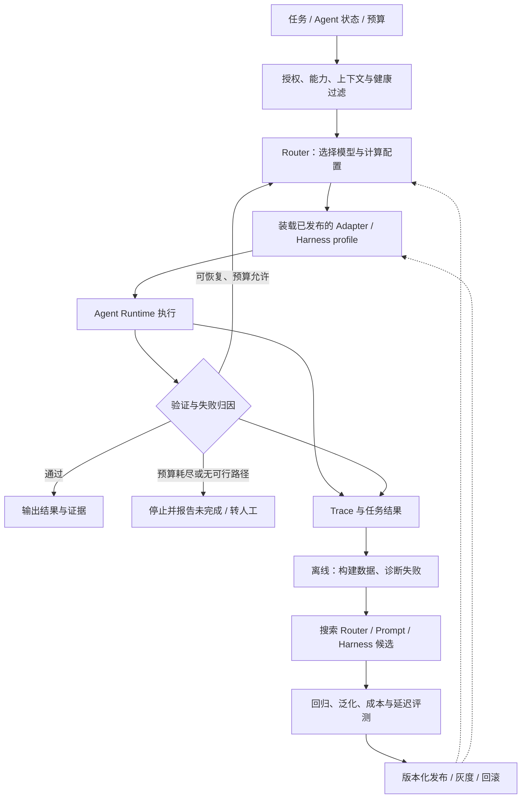

**Model Routing 在多个独立模型之间分配请求，以满足任务质量、成本和延迟要求。** 在 Agent 系统中，选择对象进一步包含推理预算与 Harness 配置：模型变化会影响工具调用、上下文使用及停止行为，因此运行时路由需要与模型适配、执行评测共同考虑。[路由综述](https://arxiv.org/abs/2603.04445)、[Self-Harness](https://arxiv.org/abs/2606.09498)

## 导航

- [1. 概念、术语与职责边界](#scope)
- [2. 系统结构：在线执行与离线优化](#architecture)
- [3. Selection：模型选择与路由算法](#selection)
- [4. 计算分配：推理预算与级联升级](#cascade)
- [5. Adaptation：跨模型适配与场景化 Prompt](#adaptation)
- [6. Evolution：轨迹驱动的 Prompt 与 Harness 优化](#evolution)
- [7. Evaluation：系统收益与泛化评测](#evaluation)
- [8. 工程实现：接入契约、状态与可观测性](#production)
- [9. 官方案例：Switchyard 的运行时升级与成本权衡](#case)
- [10. 代码与来源索引](#practice)

## 1. 概念、术语与职责边界

### 1.1 模型选择、适配与反馈优化

模型系统中的三类工作分别负责**选择执行资源、适配调用实现、依据反馈更新系统**：

| 能力域 | 决策问题 | 输入 | 产物 | 典型时机 |
|---|---|---|---|---|
| **Selection：运行时选择** | 现在用谁、用多少算力、是否升级？ | 任务、阶段、候选能力、预算、验证结果 | 模型、端点、推理配置、执行路径 | 请求前、阶段边界、失败后 |
| **Adaptation：模型与场景适配** | 当前模型与场景需要什么指令和配置？ | 稳定任务契约、模型画像、场景状态、评测数据 | Adapter、Prompt、上下文与运行配置 | 模型接入、升级；运行时按需装载 |
| **Evolution：反馈优化** | 运行后发现的问题应怎样修复？ | Trace、失败集合、指标、历史候选 | 经验证的新 Router 或 Harness 版本 | 通常在离线外循环 |

Tracing 与 Evaluation 是三者共享的证据底座：前者记录发生了什么，后者判断任务是否成功、改变是否有效，分别见[执行记录](#trace-contract)与[评测方法](#evaluation)。

**模型版本与 Harness 配置共同决定实测表现。** Profile（配置档案）记录 Prompt、示例、工具表示、上下文和运行策略，适配机制见[DSPy](#dspy)与[Self-Harness](#self-harness)。

基础术语：

| 术语 | 含义 |
|---|---|
| Router（路由器） / Gateway（网关） | Router 决定选哪个模型或配置；Gateway 提供统一的请求入口、转发与计量，内部可以包含 Router |
| Runtime（运行时） | 实际推进 Agent 任务、管理状态和执行工具调用的程序 |
| Adapter（适配器） | Adapter 将统一任务表示转换为目标模型能接收的形式，并解析结果 |
| Trace（执行轨迹） / Verifier（验证器） | Trace 记录一次任务中的调用、工具结果和产物；Verifier 按规则或证据检查结果是否满足要求 |
| Contract（契约） | 组件之间必须遵守的约定，例如输入输出结构、任务语义、权限和验收条件 |
| Snapshot（模型快照） | 用于区分模型版本的固定标识；实验应尽量锁定快照，避免同名模型更新影响对照 |

### 1.2 与执行、编排和治理的分工

在[Agent Harness 总大纲](https://wiki.huawei.com/domains/1433/wiki/6310/WIKI2026083112560088)中，M 表示 Model Routing，与其他层的职责划分如下。

| 相邻层 | 它负责什么 | M 层与它的接口 |
|---|---|---|
| L：Loop | 执行循环、维护状态、落实停止与恢复 | L 暴露阶段/进度；M 返回下一步模型与计算建议 |
| T / S：Tools / Skills | 工具能力与任务操作方法 | M 检查目标模型能否理解、调用所需工具；装载对应指导 |
| C：Context | 检索、选择、压缩、组装当次上下文 | M 选择模型与场景配置；C 按目标窗口及协议组装 |
| E：Environment | 执行命令、隔离副作用、限制资源 | 模型切换继续使用可追溯的任务环境或显式检查点 |
| G：Governance | 授权、数据去向、工具与资源边界 | G 产生硬约束；任何 Router、回退和优化候选都必须遵守 |
| V：Verification / Observability | 验收结果、校验与轨迹证据 | M 消费验证信号，不能自行降低验收标准 |
| O：Orchestration | 工作流、阶段与子 Agent 委派 | O 决定谁承担子任务；M 决定该执行单元使用的模型配置 |

模型选择与 Agent 委派可组合：前者选择推理资源，后者创建具有独立任务、上下文和工具的执行单元。MoE（Mixture of Experts，混合专家）则是在一个模型内部将 token（分词器切分出的文本单元）分配给专家子网络，与外部多模型路由的决策对象不同。[路由综述的范围定义](https://arxiv.org/abs/2603.04445)

## 2. 系统结构：在线执行与离线优化

图中实线串联在线执行与离线优化，虚线表示发布后的策略更新。**回归评测**检查旧能力是否退化；**泛化评测**检查未参与优化的新任务；**灰度发布**先让少量实际请求使用新版本。

### 2.1 Gateway 与 Runtime 的信息边界

| 位置 | 容易取得的信息 | 适合承担的工作 | 必须额外解决的问题 |
|---|---|---|---|
| Gateway | 请求文本、租户、模型池、限流、费用、端点健康 | 统一接入、请求级预路由、计量、故障转移 | Agent 阶段、工具执行和进展需由 Runtime 显式上报 |
| Agent Runtime | 当前计划、工具结果、失败历史、剩余预算、检查点 | 阶段分工、质量升级、状态交接、停止 | 接入成本、跨供应商协议、共享治理与计量 |
| 离线控制面（管理策略与版本的部分） | 跨请求结果、历史版本、候选代码与实验 | 校准阈值、适配新模型、训练 Router、发布配置 | 数据划分、选择偏差、实验成本与回归 |

Gateway 对执行进展的可见性取决于 Runtime 上报的状态。具体路由接入与状态交接见[工程实现](#production)。

### 2.2 切换粒度与状态成本

| 粒度 | 决策时机 | 优势 | 代价 |
|---|---|---|---|
| Request（请求） | 请求开始 | 简单、易评测 | 无法利用后续失败信号 |
| Turn（轮次） | 每轮模型调用前；具体接口对轮次的定义可能不同 | 可随上下文变化 | 频繁切换会破坏缓存与连续性 |
| Session（会话） | 会话开始，并尽量固定使用同一模型，即保持“会话亲和” | 行为和缓存较稳定 | 后续难度变化时不够灵活 |
| Stage / Step（阶段 / 步骤） | 定位、规划、执行、验证之间 | 利用实际进展和失败证据 | 要维护交接状态、预算与切换规则 |
| Sub-agent（子智能体） | 每次委派 | 模型与任务角色匹配 | 还需核算编排、上下文复制与汇总成本 |

粒度越细，越能利用新增反馈，也越依赖状态交接。Microsoft Foundry 明确指出路由变化会影响缓存复用：缓存收益取决于是否由同一模型处理具有重叠提示前缀的请求。[Foundry Prompt caching](https://learn.microsoft.com/en-us/azure/foundry/openai/concepts/model-router#prompt-caching)

## 3. Selection：模型选择与路由算法

### 3.1 可行集合与优化目标

路由研究通常围绕质量—成本权衡建模；Agent 系统还需纳入延迟、状态和配置。将这些目标写成加权效用，可得到以下简化表达。它是决策问题的数学表示，不是某个产品的完整内部算法。[Unified Routing & Cascading](https://proceedings.mlr.press/v267/dekoninck25a.html)、[路由综述](https://arxiv.org/abs/2603.04445)

设任务为 $x$、状态为 $s$，执行配置为 $a=(m,d,b,h)$，从满足硬约束的集合中选择：

$$
a^*=\arg\max_{a\in\mathcal A_{\mathrm{valid}}(x,s)}
\left[\widehat Q(a\mid x,s)-\lambda\widehat C(a\mid x,s)-\mu\widehat L(a\mid x,s)\right]
$$

| 符号 | 含义与口径 |
|---|---|
| $x,s$ | $x$ 是任务及输入；$s$ 是执行到当前时刻的状态，例如阶段、失败历史、剩余预算 |
| $a=(m,d,b,h)$ | $m$ 为模型，$d$ 为供应商/端点，$b$ 为计算预算，$h$ 为 Harness 配置；端点是实际接收模型请求的服务地址 |
| $\mathcal A_{\mathrm{valid}}(x,s)$ | 当前任务和状态下，满足权限、能力、窗口、可用性等硬约束的配置集合 |
| $\widehat Q(a\mid x,s)$ | 使用配置 $a$ 完成当前任务的预测质量，例如成功概率；帽子表示估计值，$\mid$ 表示“给定任务与状态” |
| $\widehat C,\widehat L$ | 预测总成本与预测延迟，分别统一使用元/任务、秒/任务等单位；它们也以 $a,x,s$ 为条件 |
| $\lambda,\mu$ | 非负的成本和延迟权重，将费用、时间换算为与质量分数可比较的扣分；权重越大，越重视对应开销 |

这条公式可读作：**在所有允许的配置中，选择“预测质量收益减去费用与等待代价”最大的一个。** 质量、货币、时间的量纲不同，不能在没有权重换算时直接相减。

真实系统还可用“质量和 SLA（Service Level Agreement，服务等级协议，约定响应时间、可用性等服务要求）达标时成本最低”的约束目标。预测质量不是已知真值；工具 Agent 应尽可能预测**最终任务结果**，而不只是下一条回复是否流畅。

| 硬约束：不满足则排除 | 软目标：在可行集合内权衡 |
|---|---|
| 数据域、获准供应商、工具权限 | 期望任务成功率、领域表现 |
| 输入模态、工具协议、输出契约 | 总成本、延迟、吞吐 |
| 当前完整输入和预留输出是否装得下 | 缓存命中、切换成本、重试概率 |
| 端点可用、配额允许、存在可用 profile | 用户偏好、质量冗余与预算余量 |

窗口检查应针对**目标模型 tokenizer（分词器）计算出的完整请求 token 数**，包含工具描述、系统指令、工具结果和输出预留。上下文窗口是模型单次调用可容纳的信息容量；不同分词器对同一文本可能得到不同 token 数。压缩是另一项要验证的信息变换，不能以静默截断代替能力检查。硬约束后若无候选，应停止或走已授权替代路径。

### 3.2 相对质量收益与训练数据

二模型选择可以预测换用强模型的相对收益；[Hybrid LLM](https://arxiv.org/abs/2404.14618) 是以质量差预测控制小/大模型调用的早期代表。

二模型场景的相对质量收益可写成：

$$
\Delta\widehat Q(x)=\widehat Q(m_s,x)-\widehat Q(m_w,x)
$$

这里 $m_s$ 表示相对高能力的模型，$m_w$ 表示相对低成本、低能力的模型；两者是当前任务与模型池中的相对称呼。$\widehat Q(m,x)$ 是模型 $m$ 在任务 $x$ 上的预测质量，$\Delta\widehat Q(x)$ 是换用强模型预计增加的质量。此处为简化记号，省略了已固定的状态、端点、预算和 profile。

例如预测成功率从 0.80 增加到 0.90，$\Delta\widehat Q=0.10$，即增加 **10 个百分点**，相对提升则为 12.5%。是否采用强模型由[效用目标](#selection-objective)决定。

数据通常来自 **task × configuration outcome matrix（任务 × 配置结果矩阵）**：每行是一项任务，每列是一种模型配置，每个单元格保存质量、成本、时延和错误记录。“反事实表现”指如果当时选择另一个配置会得到什么结果；线上只调用了 A，就通常不知道 B 在相同状态下的真实表现。因此，仅用被选模型的日志，不能直接假定训练数据无选择偏差。

### 3.3 决策机制与代表实现

[路由综述](https://arxiv.org/abs/2603.04445) 用 **When / What / How** 分别描述决策时机、使用信息与计算方法。下面按可用反馈区分主要路线。

| 路线 | 决策机制 | 代表实现与适用条件 |
|---|---|---|
| 规则与相似度基线 | 按任务、长度、能力分流，或参考相似历史任务的模型表现 | KNN（k-Nearest Neighbors，k 近邻）检索最相似的 k 个样本；稳定任务分布下的低开销参照 |
| 学习式事前路由 | 生成前预测质量或成对偏好，以阈值控制强模型比例 | [RouteLLM，ICLR 2025](https://arxiv.org/abs/2406.18665)；依赖相关偏好数据与阈值校准，偏好分数不自动等于正确率 |
| 验证驱动级联 | 先生成，根据已有输出接受结果或选择下一模型 | [Unified Routing & Cascading，ICML 2025](https://proceedings.mlr.press/v267/dekoninck25a.html) 统一比较事前路由、级联和动态选择下一模型的 cascade routing；质量估计误差影响收益 |
| 状态驱动路由 | 模型读取任务或运行历史，按能力、阶段、进展选择配置 | [Switchyard](#switchyard-escalation) 将路由嵌入多轮执行；须计入评审调用和状态切换开销 |
| 在线反馈学习 | 根据任务特征选动作，再用实际 reward（奖励反馈）更新策略 | Contextual Bandit（上下文多臂老虎机）通过探索候选获取反馈；多步 RL（Reinforcement Learning，强化学习）还考虑当前动作对后续状态和累计奖励的影响 |

**校准**检验预测分数与实际表现是否对应，例如预测 80% 成功的请求是否约有 80% 成功；**数据漂移**指线上任务分布随时间变化。在线探索与日志选择偏差的评估条件见[离线策略评估](#agent-evaluation)。

### 3.4 LLMRouterBench：统一复评与模型互补性

[LLMRouterBench（Findings of ACL 2026）](https://aclanthology.org/2026.findings-acl.1881/)覆盖 **21 个数据集、33 个模型、40 万余实例和 10 类路由基线**。统一复评确认模型互补性，但多种方法表现接近，一些近期和商业 Router 未稳定优于简单基线；扩大模型池呈现收益递减。与 Oracle 的剩余差距主要来自未能选中合适模型。

**Oracle** 是提前知道候选真实结果、逐任务选最优配置的理想参照；**Oracle gap** 是实际策略与它的差距，计算口径见[对照基线](#baselines)。该基准比较请求结果矩阵，完整 Agent 的路径依赖需通过[轨迹评测](#agent-evaluation)另行测量。

### 3.5 工业实现对照

以下为截至 2026-09-09 官方文档公开的机制与产品状态。

| 实现 | 官方公开机制 | 需要特别理解的边界 |
|---|---|---|
| [AWS Bedrock Intelligent Prompt Routing](https://docs.aws.amazon.com/bedrock/latest/userguide/prompt-routing.html) | 同家族模型间预测质量、按质量差选择；fallback model 提供质量基准 | 英语优化，不能依据应用自有表现数据调整；这里的 fallback 也指质量锚点，不仅是故障备用 |
| [Microsoft Foundry Model Router](https://learn.microsoft.com/en-us/azure/foundry/openai/concepts/model-router) | Balanced/Cost/Quality、模型子集、故障转移、底层模型缓存 | 官方提醒最小候选窗口限制；切换模型影响缓存，备用集合也须受模型子集约束 |
| [NVIDIA NeMo Switchyard](https://github.com/NVIDIA-NeMo/Switchyard) | 可嵌入 Gateway/Harness 的模型路由与原生 API 兼容接入 | pre-1.0；libsy 为 Beta，HTTP client/runner 为 Alpha，独立 server 定位 Demo/评测 |

上述产品分别覆盖托管请求级选择和嵌入式路由；具体收益需要同时报告任务集、模型池、质量与费用。Switchyard 的公开对照见[官方案例](#case)，调用职责见[接入契约](#route-contract)。
`pre-1.0` 表示尚未发布 1.0 版本；Alpha、Beta、Demo 分别是早期试验、测试阶段和演示定位，具体承诺以项目自身说明为准。`libsy` 是 Switchyard 路由库的组件名，client/runner 分别指调用客户端与运行组件。

## 4. 计算分配：推理预算与级联升级

### 4.1 事前路由、质量升级与故障转移

[事前路由](#routing-methods)依赖尚未生成时的预测；**Escalation（质量升级）**依据结果或无进展证据增加计算，可以换模型，也可以只提高同模型的推理预算；**Failover（故障转移）**针对限流、超时或服务错误，转到备用端点或获准替代模型。后两者分别处理质量与可用性，须记录不同触发原因。

### 4.2 模型、计算预算与服务方式

| 控制轴 | 改变的对象 | 评价重点 |
|---|---|---|
| Model routing（模型路由） | 训练、参数、领域能力不同的模型 | 任务成功率与单位任务成本 |
| Adaptive compute（自适应计算） | 同模型的推理等级、输出/计算预算 | 增量计算是否带来增量质量 |
| Serving / execution（服务与执行方式） | 队列优先级、批处理、并行、缓存 | 吞吐、等待时间、尾延迟 |

[Gemini 的 thinking 接口](https://ai.google.dev/gemini-api/docs/thinking) 是单模型计算控制的产品案例；可用等级与预算方式依模型而异，不能把不同厂商的 `high` 当成相同算力。

提高服务优先级主要改变等待；增加 reasoning（推理计算）可能增加推理时间；增加输出上限也不是保证“多思考”。应分别做**消融实验（ablation study）**：固定其他条件，只增删或替换一个组件，观察它对结果的贡献，避免把三个轴同时调整后的收益都记为模型路由收益。

### 4.3 级联的期望成本与盈亏条件

级联根据已经生成的结果决定是否继续调用。将[统一路由与级联框架](https://proceedings.mlr.press/v267/dekoninck25a.html)中的顺序决策简化为“弱模型 → 验证 → 至多一次强模型调用”，可按调用概率核算成本。

各项成本使用同一货币单位；数值示例为假设值。

| 符号 | 含义 |
|---|---|
| $C_r$ | 每个请求的路由开销（router） |
| $C_w$ | 每个请求先调用弱模型的平均成本（weak） |
| $C_v$ | 检查弱模型结果的平均验证成本（verification） |
| $C_s$ | 调用一次强模型的平均成本（strong）；简化模型假定直接调用与升级后调用相同 |
| $C_{sw}$ | 升级时的额外状态交接、上下文重建等切换成本（switch）；不重复计入已包含在 $C_s$ 中的费用 |
| $p$ | 升级概率，也可用大量请求中的升级比例估计，范围为 0 到 1 |
| $C_{cascade},\mathbb E[\cdot]$ | 前者是一次级联请求的总成本；后者表示对不同请求结果求期望，即长期平均值 |

若各项成本可用常数近似：

$$
\mathbb E[C_{cascade}]=C_r+C_w+C_v+p(C_s+C_{sw})
$$

式中前三类开销每个请求都会发生，强模型与切换开销只在升级时发生，所以乘以 $p$。令平均级联成本小于直接强模型成本 $C_s$，并假设 $C_s+C_{sw}>0$，可得省钱条件：

$$
p<\frac{C_s-C_r-C_w-C_v}{C_s+C_{sw}}
$$

**数值例：**取 $C_w=1,C_v=0.2,C_s=10,C_r=C_{sw}=0$。升级率 20% 时平均成本为 3.2，升级率 90% 时为 10.2；88% 是该假设下的成本平衡点。若不等式右侧不大于 0，则完全不升级也无法严格省钱。质量和延迟需分别检查[验证器误差](#verifier-quality)与[端到端耗时](#cascade-latency)。

现实中难题升级后往往使用更长上下文和更多 token，应将升级项改为 $p\,\mathbb E[C_s+C_{sw}\mid\mathrm{upgrade}]$。这里的条件期望表示“仅在发生升级的请求中计算平均成本”，不能机械套用全量强模型平均成本。共同存在的最终验收成本应在两组都计算，示例中省略共同项。

### 4.4 验证器误差与最终正确率

先假定验证器只有“接受弱模型答案”和“升级”两种动作，结果按“正确/错误”二分，并沿用[成本模型](#cascade-cost)中最多升级一次的设定。

| 符号 | 含义与分母 |
|---|---|
| $q_w$ | 弱模型正确率：弱模型答对的请求数 / 全部请求数 |
| $\alpha=P(accept\mid wrong)$ | 误放行率：错误却被接受的弱模型答案数 / 全部错误的弱模型答案数 |
| $\beta=P(upgrade\mid correct)$ | 误升级率：正确却被要求升级的弱模型答案数 / 全部正确的弱模型答案数 |
| $p$ | 升级率：升级请求数 / 全部请求数，与[成本模型](#cascade-cost)一致 |
| $q_s^{up}$ | 强模型在已升级请求中的正确率；$up$ 表示升级子集，不是乘方 |
| $Q_{cascade}$ | 级联系统最终正确率：最终答对的请求数 / 全部请求数 |

`accept`、`upgrade`、`wrong`、`correct` 分别表示接受、升级、弱模型答错、弱模型答对。所有概率取值均在 0 到 1 之间。

升级有两个来源：弱模型答错且被识别出来，以及弱模型答对却被误升级。因此：

$$
p=(1-q_w)(1-\alpha)+q_w\beta
$$

第一项 $(1-q_w)(1-\alpha)$ 对应“错误被拦截”，第二项 $q_w\beta$ 对应“正确却升级”。若升级答案直接成为最终结果，则最终正确率为：

$$
Q_{cascade}=q_w(1-\beta)+p\,q_s^{up}
$$

其中 $q_w(1-\beta)$ 是“弱模型答对且被直接接受”的比例，$p\,q_s^{up}$ 是“升级后由强模型答对”的比例，两者相加得到最终正确率。

**数值例：**若 $q_w=0.80,\alpha=0.10,\beta=0.05,q_s^{up}=0.90$，升级率为 22%，最终正确率为 $0.80\times0.95+0.22\times0.90=95.8\%$；这些概率是用于说明公式的假设值。

增大 $\alpha$ 会减少升级，却放行更多错误；增大 $\beta$ 会增加调用，还可能将原本正确的答案替换为错误答案。**$q_s^{up}$ 必须在升级子集上估计**，因为该子集通常富集难题，也包含误升级的正确答案。以上分解来自全概率公式；加入再次验证、拒答或多次升级后，须增加相应分支。

Verifier 要按业务目标设计：JSON的 Schema（结构规则）检查字段、类型等约束，不保证内容正确；SQL 能执行也不保证查询语义正确；单元测试通过受测试覆盖面约束。开放任务可用证据检查、独立 judge（评审模型或评审者）与抽样人工评价；模型自报置信度需要校准，不能直接解释为正确概率。

### 4.5 延迟与停止规则

升级路径串行、各段计时互不重叠时：

$$
T_{up}=T_r+T_w+T_v+T_{sw}+T_s
$$

$T_{up}$ 是单个升级请求的总耗时；$T_r,T_w,T_v,T_{sw},T_s$ 分别是路由、弱模型调用、验证、切换、强模型调用耗时，统一以毫秒或秒计。调用耗时应包含相应等待与生成时间，不可重复累计。这条式子先描述**单次请求**，再由一批请求计算延迟分布。

**p50 / p95 / p99** 是第 50 / 95 / 99 百分位延迟。例如 p95 为 10 秒，表示约 95% 的请求耗时不超过 10 秒；p50 即中位数，p95/p99 用于观察较慢请求的“尾延迟”。各组件 p95 **不能直接相加得到端到端 p95**，因为每段最慢的未必是同一批请求。升级路径通常比直接强模型更慢；弱/强并发能缩短等待，但需计入被放弃的推理费用。

阶段策略可采用“抽取低预算 → 根因分析较高预算 → 验证驱动升级”，但应为同一失败签名设置重试上限、总 deadline（任务截止时间）、费用上限和降级规则。**失败签名**是用于识别同类错误的结构化标记，例如“某测试持续出现同一维度错误”，不是密码学签名。停止依据是任务验收或无可行路径；预算耗尽只能报告未完成，不能改变“成功”的定义。

## 5. Adaptation：跨模型适配与场景化 Prompt

### 5.1 三层兼容性

| 层次 | 核心对象 | 最低验证 |
|---|---|---|
| 协议兼容 | role/content（消息角色/内容）、tool call/result（工具调用/结果）、流式事件、错误与停止原因 | 请求能发出，工具往返与响应能解析 |
| 能力兼容 | 模态、schema 子集、并行工具、输出结构、窗口、计算控制 | 模型实际支持当前任务所需能力 |
| 行为兼容 | Prompt、示例、工具选择、上下文使用、恢复与停止 | 目标业务质量、成本、时延达标 |

统一 SDK主要解决第一层，并协助第二层。接口返回 HTTP 200（请求成功的状态码）、字段能解析，不代表行为兼容成立。Model abstraction（模型抽象层）通过统一表示隔离协议差异，并保留能力检查和模型专属配置。[Switchyard 协议架构](https://github.com/NVIDIA-NeMo/Switchyard/blob/main/docs/architecture.md)、[DSPy Adapters](https://dspy.ai/diving-deeper/adapters/)

**模型专属配置需要随版本重验。** Anthropic 曾用 context reset（重置模型上下文，以整理后的状态继续任务）补偿 Sonnet 4.5 在窗口接近上限时过早结束的行为；换到 Opus 4.5 后，原有 reset 成为不必要负担。[Managed Agents 案例](https://www.anthropic.com/engineering/managed-agents)

### 5.2 DSPy：任务契约、程序结构与模型实现分离

| 概念 | 职责 |
|---|---|
| Signature（任务签名） | 声明输入输出字段及语义要求，例如“问题、证据 → 有依据的答案”；字段名、描述和类型共同表达任务 |
| Module（程序模块） | 组织 Predict（按任务签名调用模型生成输出）、推理或工具调用等行为 |
| Adapter（适配器） | 把 Signature 序列化为具体请求文本/字段，并解析响应 |
| Optimizer（优化器） | 用数据与 metric（评测指标或评分函数）搜索更有效的指令、示例等 |

换模型后可以保持任务程序，重新编译：通过评测搜索指令、示例等参数，再保存、装载用于推理。[DSPy 优化器](https://dspy.ai/diving-deeper/choosing-an-optimizer/)、[保存与装载](https://dspy.ai/getting-started/saving-and-loading/)

**MIPROv2** 是 DSPy 中联合优化 instruction（任务指令）与 demonstrations / demos（输入输出示例）的实现：从执行中构造示例、依据程序和数据提出指令，再按最终指标搜索各模块的组合。它适用于程序结构固定、缺少模块级标签的情况；轨迹反思式优化见[GEPA](#gepa)。[MIPRO](https://aclanthology.org/2024.emnlp-main.525/)、[MIPROv2 API](https://dspy.ai/api/optimizers/MIPROv2/)

### 5.3 PromptBridge：源模型到目标模型的提示映射

本节的 source → target 指“源模型 → 目标模型”。**Model drifting（跨模型提示效果漂移）**指源模型偏好的 Prompt 在目标模型上可能不再有效；A→B 与 B→A 的迁移损失不必相同。这里讨论跨模型的效果变化，与[第 3 节](#selection)随时间发生的数据分布漂移不同。

[PromptBridge](https://arxiv.org/abs/2512.01420) 的两阶段机制：先在 calibration tasks（用于学习迁移规律的校准任务）上获取源/目标模型各自偏好的 Prompt 对，提炼模型对映射；面对新任务，再由 Adapter Model（执行提示改写的大模型）利用源 Prompt 与映射生成目标 Prompt。这里的 Adapter Model 负责提示改写，[DSPy Adapter](#dspy) 负责请求格式转换与结果解析。其成本优势来自映射跨任务复用。

三个边界：**training-free 指不更新模型权重，不等于无校准成本。无需逐任务重搜索不等于原 Prompt 原样复用；目标模型已参与 calibration，不等于对完全未见模型零样本泛化。**

### 5.4 直接迁移、重编译与校准后迁移

| 模式 | 目标模型反馈是否用于适配 | 真正验证的问题 |
|---|---|---|
| Direct transfer（直接迁移） | 不重新搜索；必要协议转换须披露 | 原 Prompt/Harness 可移植多少 |
| Recompile after swap（切换后重编译） | 在目标模型上重新优化 | 花多少数据/费用能恢复或提高表现 |
| Calibrated transfer（校准后迁移） | 先在目标模型校准，再迁移未见任务 | 模型对映射能否跨任务复用和摊销 |

[DSPy](#dspy)/[MIPROv2](#mipro)、模型特定 [GEPA](#gepa) 或 [Self-Harness](#self-harness) 通常支持第二种命题；[PromptBridge](#promptbridge) 重点研究第三种；源模型搜索后冻结 Harness 再测试其他模型，才直接检验第一种。

### 5.5 提示迁移矩阵与效果差距

Prompt Portability Matrix 即“提示迁移表现矩阵”。设 $P_i$ 为在模型 $M_i$ 上得到的 Prompt，定义 $A_{ij}=Q(P_i, M_j,)$：

- $i$ 是 Prompt 的来源模型编号，$j$ 是实际执行的目标模型编号。
- $M_j$ 是目标模型；$P_i$ 是来自源模型的提示配置。
- $Q(P_i, M_j,)$ 是这对组合在同一未见任务集上的实际质量分数，越高越好；
- $A_{ij}$ 是矩阵第 $i$ 行、第 $j$ 列的得分；下表的 A、B、C 是三种模型的代号。

行表示 Prompt 来源，列表示实际执行模型，交叉评测如下：

| Prompt 来源 \ 执行模型 | $M_A$ | $M_B$ | $M_C$ |
|---|---|---|---|
| $P_A$ | $A_{AA}$ | $A_{AB}$ | $A_{AC}$ |
| $P_B$ | $A_{BA}$ | $A_{BB}$ | $A_{BC}$ |
| $P_C$ | $A_{CA}$ | $A_{CB}$ | $A_{CC}$ |

定义 $Gap_{i\to j}=A_{jj}-A_{ij}$，比较的是**同一个目标模型**用本模型 Prompt 与外来 Prompt 的差距。不要用 $A_{ii}-A_{ij}$ 代表纯适配损失，那同时改变了模型能力。对角线只是实验中找到的配置，不是真正全局最优，Gap 可以为负。

PromptBridge 的 HumanEval 结果给出实际例子：GPT-5 的优化 Prompt 在 Llama-3.1-70B-Instruct 上得分 68.70%，而 Llama 自身优化 Prompt 为 79.47%，在同一目标模型上的差距为 **10.77 个百分点**；反向迁移在 GPT-5 上的差距为 99.39%−96.95%=**2.44 个百分点**。HumanEval 是以函数实现和测试验证为核心的代码基准；这组结果体现迁移方向的不对称。[PromptBridge Figure 1 与附录 A.1](https://arxiv.org/html/2512.01420v1#S1)

每格同时记录质量、schema pass（结构校验通过率）、工具成功率、成本、时延；再加入 adapter-only（仅换适配器）、重新编译 Prompt、完整 profile 适配等消融，分离收益来源。

### 5.6 场景化 Prompt：按需加载行为指令

**场景化 Prompt 将只在特定任务或阶段生效的指令从常驻 system prompt（系统提示）中拆出，按需加载，用于控制执行过程与结果呈现。** 常驻部分保留通用任务契约、必要约束与默认行为；场景部分规定当前如何分析、验证、停止和输出。目标是减少无关指令的干扰，保留足够的信息，而非单纯追求最短文本。[Anthropic 上下文工程](https://www.anthropic.com/engineering/effective-context-engineering-for-ai-agents)

它与跨模型适配是两个维度：场景决定加载哪些行为要求，模型适配决定这些要求如何表达和执行。按[职责分工](#section-1-2)，M 管理场景配置及模型适配，C 组装上下文，L 在阶段变化时重新判定，V 验证结果。Cursor Rules 已提供常驻、模型判断、文件匹配和显式引用等加载方式，体现了从“始终携带”到“条件生效”的机制。[Cursor Rules](https://cursor.com/docs/rules)

**与 Skill / Tool 的关系。** 场景 Prompt 侧重“怎样做、怎样呈现”；Tool 提供查询、执行和修改能力；Skill 封装可复用的流程、知识、脚本与资源。场景 Prompt 可以由 Skill 承载，重叠规则应只有一个维护来源。[Agent Skills 规范概览](https://agentskills.io/home)

运行链路为：**识别任务与阶段 → 召回候选 → 校验适用条件 → 解决冲突与预算约束 → 装载已发布版本 → 执行和验收 → 到期撤销或切换**。召回是找候选，激活才是实际放入模型上下文；相似度高不等于适用。工程上需同时处理：

| 问题 | 处理机制 |
|---|---|
| 冲突 | 平台声明作用域、依赖和互斥关系；同一受管层内按确定规则选取版本与优先级，禁止靠拼接顺序裁决。场景规则不能覆盖更高层契约；无法消解时回到基线，缺少必要任务条件则澄清或暂停 |
| 误召：无关规则被激活 | 用任务意图、阶段、排除条件做二次校验，允许不激活任何场景；阶段变化时重判，避免“读到测试文件”就误判为“执行修复” |
| 未召：必要规则未激活 | 通用行为与关键验收常驻或由 Runtime 强制检查；验收失败后按原因进行有界补召回，仍无法满足则报告缺项，不能把全部 Prompt 塞回去 |
| 过期与叠加 | 每条规则绑定本轮、阶段或任务的有效期；阶段结束后不再作为有效指令传入后续调用。保留审计记录，但不能声称撤销 Prompt 能撤回已发生的操作 |

例如“代码审查”场景要求只报告有证据的问题；用户改为“修复并测试”后，应结束审查规则的作用域，加载修复与验证要求。两阶段可使用同一套工具，变化的是过程和交付方式。

**平台管理的是有限的规则组合空间。** 每个场景记录负责人、正反触发样例、有效期、依赖/互斥、token 预算、适用模型与版本。限制目录规模、同时激活数量和总 token，新增前检查能否合并或替换旧规则；更新以“基线 + 选择器 + 组合规则 + 场景版本”为发布单元，配套组合回归、灰度与整组回滚。LangSmith 的负责人、版本、环境提升与回滚是相关管理能力的官方实例，不能替代规则冲突检查。[LangSmith Prompt 管理](https://docs.langchain.com/langsmith/manage-prompts)

评测同时比较全量常驻、精简基线、动态加载和人工标注正确场景加载，区分指令内容与选择机制的贡献；记录误激活、漏激活、冲突、兜底成功、任务质量及完整 token/延迟。具体口径见[场景化 Prompt 评测](learning_reports/04-evaluation-and-production.md#scenario-prompt-eval)，配置记录并入[执行轨迹](#trace-contract)。

## 6. Evolution：轨迹驱动的 Prompt 与 Harness 优化

优化循环通常包含：提出 candidate（候选 Prompt、配置或代码）、执行 rollout（一次试运行）、由 evaluator（评测器）评分，再决定是否接受。Proposer 是提出修改的模型或程序；reflection（反思）是根据轨迹解释失败并生成修改。

### 6.1 GEPA：Prompt 的反思演化

GEPA（Genetic-Pareto，结合遗传式演化与帕累托选择）用执行轨迹和文字反馈诊断失败，反思生成修改；保留在不同实例上取得最佳表现的候选，并合并互补修改。这种 **Pareto（帕累托）候选选择**利用实例间的能力互补，关注点不同于部署时的[质量—成本前沿](#pareto-statistics)。GEPA 已被 ICLR 2026 接收，论文通过具体任务与优化预算下的对照评估反思式搜索。[GEPA 论文](https://arxiv.org/abs/2507.19457)

反思负责生成候选，任务指标负责验证收益；候选选择与最终测试的区别见[评测数据划分](#data-splits)。

### 6.2 Self-Harness：模型专属修改与回归接受

Self-Harness 固定目标模型，按“弱点挖掘 → 候选修改 → 回归验证”优化其周边系统。例如论文观察到 GLM-5 在命令间丢失环境状态、探索与实现失衡，据此修改环境设置的保留方式，并推动更早进入实现和测试。[Self-Harness §3](https://arxiv.org/html/2606.09498v1#S3)

Self-Harness §3.4 的接受规则是：**held-in 与 held-out 两个子集的通过数均不下降，且至少一项严格增加**。Held-in 提供诊断证据；held-out 不向 proposer 展示，但参与自动接受。因此后者承担回归验证功能，不是从未影响选择的最终测试。[Self-Harness 验证规则](https://arxiv.org/html/2606.09498v1#S3.SS4)

上述修改来自定性轨迹分析，不能据此分离每个组件的独立增益；各模型分别优化自己的 Harness，也不等于[直接迁移](#transfer-modes)。

### 6.3 Meta-Harness：代码搜索与原始轨迹的贡献

Meta-Harness 将优化对象扩展到可执行 Harness：外层 proposer 读取历史候选源码、分数和完整轨迹，修改存储、检索和上下文等机制。[Meta-Harness](https://arxiv.org/abs/2603.28052)

Meta-Harness 的在线分类消融比较 proposer 可读取的信息。下表的数值是该实验的候选准确率统计，不是跨业务平均提升；**所有组都可读取代码**，“仅分数”指不提供摘要或原始轨迹。[Meta-Harness Table 3](https://arxiv.org/html/2603.28052v1#S4.SS1)

| 反馈信息 | 中位准确率 | 最佳准确率 |
|---|---:|---:|
| 代码 + 分数 | 34.6% | 41.3% |
| 代码 + 分数 + 摘要 | 34.9% | 38.7% |
| 代码 + 分数 + 原始轨迹 | 50.0% | 56.7% |

在检索增强数学实验中，搜索出的 Harness 在 200 道 IMO（International Mathematical Olympiad，国际数学奥林匹克）级题目上，使五模型平均 [Pass@1](#metrics) 从无检索的 34.1% 提升到 38.8%；相对 BM25（Best Matching 25，依据词频、逆文档频率与文档长度打分的检索方法）基线 37.5%，增益是 **1.3 个百分点**，不是 4.7 个百分点。不同基线回答不同问题：前者包含检索收益，后者更接近检索策略改进的贡献。[Meta-Harness Table 6](https://arxiv.org/html/2603.28052v1#S4.SS2)

### 6.4 从固定配置到经验驱动与优化器自适应

[MemoHarness（2026-07）](https://arxiv.org/abs/2607.14159) 检索历史任务经验和全局规律，为当前实例生成专属 Harness，将可复用经验带入运行时配置选择。[SePO（Self-Evolving Prompt Agent，2026-06）](https://arxiv.org/abs/2606.04465) 同时优化 Task Agent（执行任务的智能体）与 Prompt Agent（优化提示的智能体）的系统提示，让提出修改的策略也参与演化。两者分别改变“每个任务使用什么配置”和“如何产生下一次优化”，新增价值需按[优化费用摊销](#amortization)与[持续优化评测](#continual-evolution)衡量。

### 6.5 持续优化：迁移、再优化与回归

[Do Agent Optimizers Compound?](https://arxiv.org/html/2607.14004v1) 固定基础 Agent，第一阶段使用 12 个任务，第二阶段新增 10 个任务。Phase 1 得分在原 12 任务上计算；Transfer 是未追加优化时在 **22 任务合集**上的得分；Final 是第二轮优化后在同一合集上的得分。因此不能将 Phase 1→Transfer 的变化全部视为遗忘。

| 方法 | Phase 1：12 任务 | Transfer：22 任务 | Final：22 任务 |
|---|---:|---:|---:|
| 未优化基线 | 62.5% | 56.8% | 56.8% |
| [GEPA](#gepa) | 70.8% | 54.5% | 72.7% |
| [Meta-Harness](#harness-evidence) | 66.6% | 68.2% | 59.1% |
| RELAI-VCL（RELAI 的 Verifiable Continual Learning，可验证持续学习） | 79.2% | 72.7% | 77.3% |

在该实验中，[GEPA](#gepa) 的 Transfer 低于同合集基线；[Meta-Harness](#harness-evidence) 的第二轮优化反而降低合集得分。结果表明首次优化收益不足以预测迁移和持续优化效果；证据范围是这组小规模、两阶段实验。[实验协议与结果](https://arxiv.org/html/2607.14004v1#S5)

反复优化可能产生**过拟合**：配置越来越适合已见样本，却无法保持新任务表现。候选生成、回归验证与独立测试的角色见[评测数据划分](#data-splits)。

## 7. Evaluation：系统收益与泛化评测

### 7.1 评测对象与对照基线

Anthropic 的 Agent 评测框架区分 task（任务）、trial（一次尝试）、transcript（执行记录）和 outcome（环境中的最终结果），并指出答案文本不能替代真实结果。因此模型路由的评测对象也应包含模型调用、工具、验证与恢复组成的完整系统。[Demystifying evals for AI agents](https://www.anthropic.com/engineering/demystifying-evals-for-ai-agents)

| 对照组 | 用途 |
|---|---|
| Always-Efficient / Always-Capable（始终使用低成本 / 高能力配置） | 判断路由相对固定配置的价值 |
| Best-Single（最优单一配置） | 在验证集选最优单一配置，再锁定到测试；避免只与差基线比较 |
| Random / Budget-matched Random（随机 / 预算匹配随机） | 后者把平均预算调到与待测 Router 相近，区分模型混用比例的收益与 Router 识别能力 |
| Rule Router（规则路由） | 判断复杂算法是否值得额外维护与推理开销 |
| Learned Pre-router / Cascade（学习式事前路由 / 级联） | 比较事前预测与结果后升级 |
| Oracle（已知结果的理想选择器） | 用已知结果逐任务选最大效用，估计可达到空间；不可部署 |

[LLMRouterBench](#section-3-4) 使用预收集结果比较策略。Oracle 与实际策略须共享候选约束和效用口径；基于单次随机结果逐题挑选得到的是该矩阵的上限，不是已知可稳定实现的部署表现。

### 7.2 质量、费用、延迟与路由指标

| 维度 | 指标 | 常见错误口径 |
|---|---|---|
| 质量 | 端到端成功率、Pass@1、问题解决率、业务原生评分 | 用格式通过率替代任务成功率 |
| 路由 | 效用 regret、Oracle gap、优质候选召回、升级率 | 只报选中“强模型”的分类准确率 |
| 费用 | 全部调用、验证、失败重试、切换、工具执行；优化成本另列 | 只计算最后一次成功模型调用 |
| 效率 | 总费用 / 成功任务数，同时报任务成功率 | 删除失败任务后计算“平均成本” |
| 延迟 | E2E p50/p95/p99、TTFT、升级与未升级子集 | 只报 Router 自身耗时或平均时延 |
| 稳定性 | 超时、工具错误、恢复失败、无进展循环、回退 | 排除所有报错请求后报告质量 |
| 泛化 | 按项目/任务族/语言/上下文长度/时间分桶 | 总均值掩盖关键业务退化 |

指标缩写与口径：

- **Pass@1**：每个任务只提交一个候选结果时的通过率，不是从多个候选中挑最好的通过率。Agent 场景还应声明一个候选是否允许内部工具重试。
- **E2E（End-to-End，端到端）**：从收到任务到最终结束的完整耗时，包括路由、等待、工具、重试与验证。
- **TTFT（Time to First Token，首 token 时间）**：从发送请求到收到第一个输出 token 的时间；应说明是否将推理事件算作首个输出。它不等于任务完成时间。
- **优质候选召回**：能达到质量要求或接近最优效用的模型，有多少被 Router 纳入待选集合；应先定义“优质”的阈值。
- **Slice（数据切片）/ 分桶**：按语言、项目、任务类型等条件划分评测子集，分别看结果，避免总体均值掩盖局部退化。

**平均路由遗憾（Regret）**表示实际路由比逐任务最优选择损失了多少效用：

$$
\overline R=\frac{1}{N}\sum_{i=1}^{N}\left(U_i^*-U_i^{route}\right)
$$

$N$ 是评测任务总数，$i$ 为任务编号；$U_i^*$ 是 Oracle 在第 $i$ 个任务上的最优效用，$U_i^{route}$ 是实际路由的效用；$\sum$ 表示求和，$\overline R$ 是平均差距，越小越好。效用 $U$ 可采用[第 3.1 节](#selection-objective)的“质量减去成本和延迟扣分”，但这里使用实测结果，两组必须采用相同权重、候选约束及开销口径。

例如两个任务的效用差分别为 0.10、0.04，平均 Regret 为 0.07；只有当效用本身就是正确率时，才可将其解释为正确率差距。预算耗尽、无模型可用等情况保留在任务分母中，明确标记为失败或未完成。

### 7.3 Pareto 前沿、配对统计与数据划分

对阈值、预算和升级条件做 sweep（系统扫描一组取值），画质量—成本与质量—延迟曲线。**Pareto frontier（帕累托前沿）**是不能在不牺牲某个目标时继续改善其他目标的配置集合。例如，另一配置质量不低且费用更低时，当前配置就不在质量—成本前沿上；只展示一个挑选后的点无法说明策略整体更好。

同一批任务在不同系统下运行，应采用**配对比较**：逐任务比较 A 与 B，再汇总差异，而不是比较两批难度不同的任务。

| 方法 / 概念 | 含义及用途 |
|---|---|
| [Paired bootstrap（配对自助重采样）](https://docs.scipy.org/doc/scipy/reference/generated/scipy.stats.bootstrap.html) | 按任务有放回抽样，每次保留同一任务的 A/B 结果对，重算平均差，用差值分布估计不确定性 |
| [McNemar 检验](https://www.statsmodels.org/stable/generated/statsmodels.stats.contingency_tables.mcnemar.html) | 用于同一批样本上的二元结果，重点比较“A 成功 B 失败”和“A 失败 B 成功”的数量是否明显不对称 |
| 置信区间（Confidence Interval，CI） | 量化统计估计的不确定范围；例如报告平均质量差及其 95% CI，避免只展示点估计 |
| 按任务聚类重采样 | 将同一任务的多次运行作为一组抽样，保留其相关性，不把重复调用误当成独立新任务 |

尾延迟需要足够请求，少量任务的 p99 不足以支撑稳定 SLA。

**数据划分按参与优化的角色确定。** 训练集用于生成候选；验证集用于阈值校准与回归接受；最终测试集不参与选择。[Self-Harness 的接受规则](#self-harness)展示了 held-out 集参与回归验证的具体方式。同项目、任务族、时间段和同一轨迹的样本应按相关性分组，避免随机拆分造成内容泄漏。[scikit-learn 数据划分](https://scikit-learn.org/stable/modules/cross_validation.html)

反复比较多个方法和阈值会增加偶然选中高分配置的机会，最终比较须在未参与选择的数据上进行。不同实验还需对齐任务划分、重复次数和指标：单次 Terminal-Bench 成绩不能与[持续优化](#continual-evolution)的 lifelong average（各阶段通过率的平均）混用。

### 7.4 完整轨迹与离线策略评估

离线请求结果矩阵可以比较单次选择，但改变某一步模型会改变后续工具动作和状态。因此不能把旧轨迹中每一步的“局部最好结果”拼起来，声称得到新策略的最终成功率。

应在可重置环境中做完整 episode（从任务开始到结束的一次完整运行）对照；需要分支重放时，从相同 checkpoint（可恢复的任务状态检查点）创建独立环境。

**Shadow（影子评测）**让候选系统处理真实请求的副本，结果不交付用户；写文件、提交、发消息等副作用必须在隔离副本中执行或模拟。它与 **canary（金丝雀发布）**不同：后者让少量真实用户请求实际使用候选系统，并监控其效果。

在线 Bandit 评测使用日志中的动作、反馈与选择概率。重要性加权等方法要求待评估策略可能选择的动作，在日志策略中也有非零选择机会，即满足支持范围条件；若旧策略从未在某类任务上选 B，日志不能直接识别 B 在该类任务上的真实收益。[Vowpal Wabbit 离线策略评估](https://vowpalwabbit.org/docs/vowpal_wabbit/python/latest/tutorials/off_policy_evaluation.html)、[Deficient Support 研究](https://arxiv.org/abs/2107.11533)

### 7.5 优化费用与摊销

一次适配总费用为 $C_{opt}$，部署后每任务净节省 $\Delta c>0$，则按固定单任务净节省计算的盈亏平衡请求量为：

$$
N_{break-even}=\frac{C_{opt}}{\Delta c}
$$

$N_{break-even}$ 表示收回适配投入所需的请求数量；$C_{opt}$ 是一次性优化总费用，例如以元计；$\Delta c$ 是“旧配置每请求成本减去新配置每请求成本”，例如以元/请求计。实际所需请求数应向上取整。若 $\Delta c\le0$，则无法仅靠在线费用节省收回投入。

$C_{opt}$ 包括候选生成、反思、试运行、验证、沙箱与必要人审；$\Delta c$ 的新旧成本都应包含在线路由和验证开销，且须在质量/延迟可接受条件下比较。例如一次优化花 1,000 元、每请求净省 0.02 元，需要 50,000 次请求才能收回投入。如果配置有效期内流量不足，逐模型高成本优化未必划算；[PromptBridge](#promptbridge) 类映射的价值也应按跨任务复用量核算。

## 8. 工程实现：接入契约、状态与可观测性

### 8.1 接入契约：客户端、目标与路由分离

Switchyard 将网络接入、真实模型和客户端可见路由分成三层。客户端请求 route ID，由算法选择 target；端点和认证由 LLM client 管理。[Switchyard Core Concepts](https://github.com/NVIDIA-NeMo/Switchyard/blob/main/docs/core_concepts.md)

| 对象 | 定义 | 修改影响 |
|---|---|---|
| LLM client（模型客户端） | 上游地址、协议格式、凭证环境变量与重试策略 | 网络连接、认证和传输 |
| Target（调用目标） | 一个上游模型 ID 及调用它的 client | 实际执行模型 |
| Route（路由） | 客户端可见的模型 ID，以及选择 target 的算法 | 选择策略与候选集合 |

代理请求生命周期为：**接收原生请求 → 标准化表示 → 应用路由策略 → 调用后端与回退 → 转换响应**。这将[协议兼容](#compatibility)与[模型选择](#selection)分离；协议转换本身不证明跨模型行为等价。[Switchyard Architecture](https://github.com/NVIDIA-NeMo/Switchyard/blob/main/docs/architecture.md)

嵌入式模式由路由算法产生调用步骤，宿主 Harness 执行请求并回传结果；算法结束后，宿主使用已生成答案或执行最终调用。调用、凭证和重试的责任因此需要明确。[Switchyard 嵌入示例](https://github.com/NVIDIA-NeMo/Switchyard/blob/main/examples/libsy.py)

### 8.2 状态交接：任务记录与供应商推理状态

| 状态 | 内容 | 迁移方式 |
|---|---|---|
| 任务状态 | 用户目标、消息、工具结果、文件与产物、已执行操作 | 保存可审计事件和持久化产物，在目标模型上下文中重新组织 |
| 供应商推理状态 | reasoning state、thought signatures 等续传信息 | 遵循原生协议；不能假设不同模型能解释同一状态标记 |

Anthropic Managed Agents 把 session（会话）实现为只追加事件的日志，与 Harness、sandbox（隔离执行工具和代码的沙箱）解耦；Gemini 规定某些多轮调用需要回传 thought signatures（推理状态签名）。前者保存任务事实，后者服务特定模型协议，不能用一段摘要将两者等同替换。[Managed Agents](https://www.anthropic.com/engineering/managed-agents)、[Gemini thinking](https://ai.google.dev/gemini-api/docs/thinking)

**模型升级与故障重试具有不同状态语义。** 升级沿任务进展继续；请求超时却可能是“服务已执行、客户端未收到响应”。文件写入、发送或提交重试前需要核对结果，重试次数与超时也需按完整调用链核算。[AWS：超时、重试与退避](https://d1.awsstatic.com/builderslibrary/pdfs/timeouts-retries-and-backoff-with-jitter.pdf)

### 8.3 执行记录：标准遥测与实验血缘

OpenTelemetry（OTel，开放遥测框架）以 trace 串联操作链，以 span 表示模型调用、工具执行等片段。GenAI（Generative AI，生成式人工智能）语义约定定义模型请求、响应、用量与错误等属性；字段与稳定性应按实际使用版本记录。[OpenTelemetry GenAI](https://github.com/open-telemetry/semantic-conventions-genai)、[GenAI spans](https://github.com/open-telemetry/semantic-conventions-genai/blob/main/docs/gen-ai/gen-ai-spans.md)

| 记录层次 | 要回答的问题 | 内容 |
|---|---|---|
| 调用身份 | 请求谁，最后由谁执行？ | 请求/响应模型、供应商、操作类型、trace/span 关联 |
| 调用用量 | 每次尝试消耗多少？ | 输入/输出 token、缓存、耗时、错误与计费语义 |
| 路由依据 | 为何选择、为何升级？ | 候选与排除原因、分数/阈值、阶段、预算、策略版本 |
| 任务验收 | 最终是否完成？ | 产物、工具结果、评测器版本、得分、失败原因 |
| 配置血缘 | 结果由哪些改变产生？ | 模型快照、Prompt/Adapter/Harness 版本、父候选、代码 diff、数据划分 |

前两行可对齐标准遥测；后三行是应用层实验记录，分别对应[路由决策](#selection-objective)、[任务评测](#metrics)和[Harness 搜索](#harness-evidence)。Diff 是代码版本差异；血缘记录候选由哪些父版本与修改产生。

费用按实际 attempt（一次调用尝试）累加；“重试”“升级”是调用类型，不再额外加一份已统计的生成费用。输入输出原文与结构化用量分开管理，避免为了计量而无条件保存敏感内容。[GenAI 用量与内容约定](https://github.com/open-telemetry/semantic-conventions-genai/blob/main/docs/gen-ai/gen-ai-spans.md)

[场景化 Prompt](#scenario-prompts)另记录候选与激活项、触发/排除原因、作用域、组合版本及兜底结果。模型或 Prompt 更新后，须重新校准 Router；配置版本、数据版本和逐任务结果共同构成对照记录。评测过程见[迁移模式](#transfer-modes)、[配对统计与数据划分](#pareto-statistics)。

## 9. 官方案例：Switchyard 的运行时升级与成本权衡

### 9.1 从答案级联到会话升级

Switchyard 的 escalation route 为多轮 Agent 维护升级状态：先调用低成本模型，由 judge（评审模型）读取已完成轮次，检查持续出错、循环或任务偏离；达到连续升级判定次数后，会话锁定到强模型。它利用实际执行结果，与事前预测难度的 capability routing 不同。[Escalation Router](https://github.com/NVIDIA-NeMo/Switchyard/blob/main/docs/routing_algorithms/escalation_router_routing.md)

| 控制项 | 作用 |
|---|---|
| `classifier_target` | 指定执行状态的 judge |
| `weak_target` / `strong_target` | 指定初始模型与升级目标 |
| `confirmations` | 触发切换所需的连续升级判定次数 |
| `recent_turn_window` | judge 读取的近期历史范围 |

会话升级持续影响后续轮次，不能直接将[二阶段成本公式](#cascade-cost)视为完整 Agent 成本模型；还需累计所有轮次的执行模型、judge、状态交接与工具耗时。

### 9.2 同一基准下的质量与成本

Switchyard 公布的 **v0.2.0 / Terminal-Bench 2.1** 结果如下。Terminal-Bench 是在终端环境完成实际任务的 Agent 基准；费用是该轮基准运行的官方总费用，不是单任务单价。[Benchmark Provenance](https://github.com/NVIDIA-NeMo/Switchyard#benchmark-provenance)

| 配置 | 任务准确率 | 总费用（美元） | 相对基线准确率变化 | 费用下降 |
|---|---:|---:|---:|---:|
| 固定 Claude Opus 4.8 | 76.0% | 98.06 | — | — |
| Escalation | 75.7% | 85.00 | −0.3 个百分点 | 13.3% |
| Stage routing | 72.7% | 68.19 | −3.3 个百分点 | 30.5% |
| Capability routing | 71.2% | 79.32 | −4.8 个百分点 | 19.1% |

运行使用 NVIDIA 内部推理端点，切换服务栈后绝对结果可能变化。Escalation 保持约 99.6% 的基线准确率，并不等于准确率提高 99.6%；Stage 的更低费用伴随更大的质量损失。[结果设置](https://github.com/NVIDIA-NeMo/Switchyard#benchmark-provenance)

表中未给出完整端到端尾延迟或质量差异的置信区间，不能单凭 75.7% 与 76.0% 断言统计意义上的质量非劣。比较方法见[配对统计与 Pareto 前沿](#pareto-statistics)。

## 10. 代码与来源索引

### 10.1 开源实现

| 项目 / 入口 | 关键实现 | 对应正文 |
|---|---|---|
| [LLMRouterBench](https://github.com/ynulihao/LLMRouterBench) | 模型结果矩阵、Oracle 与质量—成本曲线 | [统一基准](#section-3-4) |
| [RouteLLM](https://github.com/lm-sys/RouteLLM) | 路由分数学习、阈值校准与强模型调用比例 | [路由机制](#routing-methods) |
| [cascade-routing](https://github.com/eth-sri/cascade-routing) | 验证决策、升级阈值与后续模型选择 | [级联分析](#cascade) |
| [Switchyard](https://github.com/NVIDIA-NeMo/Switchyard) | 路由算法与调用执行分离，协议转换、状态和重试 | [工程实现](#production)与[官方案例](#case) |
| [DSPy](https://github.com/stanfordnlp/dspy) | 任务签名、请求序列化、响应解析与程序优化 | [程序编译](#dspy) |
| [GEPA](https://github.com/gepa-ai/gepa) | 反思提议、候选保留与合并 | [GEPA](#gepa) |
| [Meta-Harness](https://github.com/stanford-iris-lab/meta-harness) | 历史代码与轨迹访问、可执行 Harness 搜索 | [Meta-Harness](#harness-evidence) |
